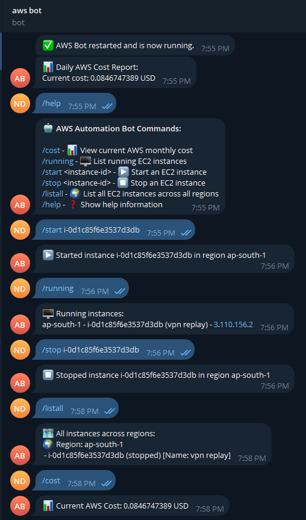

# 🤖 AWS Automation Telegram Bot

Lightweight Telegram Bot for AWS cost reporting and EC2 instance management.


---

## 📋 Features

- 📊 Daily AWS Cost Reporting to Telegram
- 🖥️ List Running EC2 Instances
- ▶️ Start EC2 Instances
- ⏹️ Stop EC2 Instances
- 🌍 List All EC2 Instances Across AWS Regions
- 🔄 Automatic Region Detection
- 🚀 Docker-ready for easy deployment

---

## 📸 Screenshots



> Example showing the bot handling AWS cost reporting and EC2 instance management commands.

---

## 🚀 Getting Started

### 1. Prepare `.env` file

Create a `.env` file with the following content:

```env
AWS_ACCESS_KEY_ID=your_aws_access_key
AWS_SECRET_ACCESS_KEY=your_aws_secret_key
AWS_REGION=us-east-1

TELEGRAM_TOKEN=your_telegram_bot_token
TELEGRAM_CHAT_ID=your_telegram_chat_id
```

---

## 🐳 Recommended: Run with Docker Image

The easiest way to run this bot is using the official Docker image from Docker Hub.

### 1. Pull the latest image

```bash
docker pull conbocuoi/telegram-aws-bot:latest
```

### 2. Run the bot

```bash
docker run -d --restart always --env-file .env --name telegram_aws_bot conbocuoi/telegram-aws-bot:latest
```

- Auto-restart if the container crashes or server reboots.
- Easy environment variable management.
- Fast setup without local Python installation.

---

## 📖 Available Commands

| Command | Description |
|:---|:---|
| `/cost` | View current AWS monthly cost |
| `/running` | List running EC2 instances |
| `/start <instance-id>` | Start an EC2 instance |
| `/stop <instance-id>` | Stop an EC2 instance |
| `/listall` | List all EC2 instances across regions |
| `/help` | Show available bot commands |

---

## 📦 Deployment Options

- Railway.app (Free up to 500 hours)
- Fly.io (3 free micro VMs - recommended for 24/7 bot)
- Google Cloud Run (Free Tier)
- AWS Free Tier (EC2 Micro)

> Detailed deployment guide is coming soon!

---

## 🛠 Built With

- Python 3.10
- python-telegram-bot
- boto3
- Docker

---

## 📬 Contact

Maintained by [ConBoCuoi](https://hub.docker.com/u/conbocuoi).  
Feel free to contribute or report issues! 🚀

---

## 📄 License

Distributed under the MIT License.